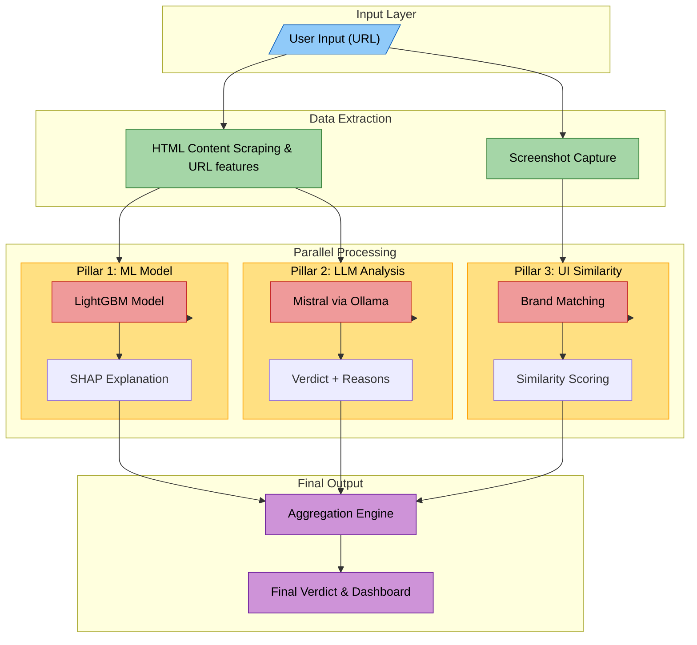
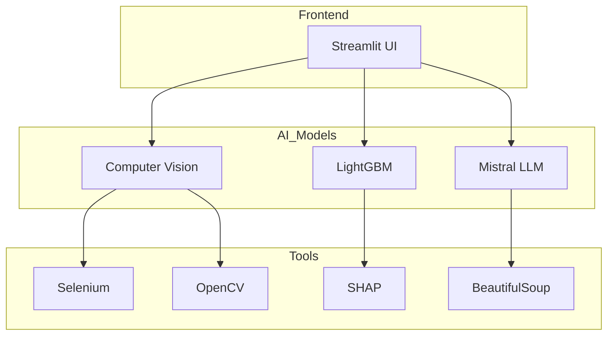

```mermaid
flowchart TD
    A[Module Outputs] --> B[Score Normalization]
    
    B --> C[ML Score - Weight 0.5]
    B --> D[LLM Score - Weight 0.3]
    B --> E[CV Score - Weight 0.2]
    
    C --> F[Weighted Sum Calculation]
    D --> F
    E --> F
    
    F --> G{Final Score ≥ 0.5?}
    
    G -->|Yes| H[LEGITIMATE]
    G -->|No| I[PHISHING]
    
    H --> J[Confidence Level]
    I --> J
    
    J --> K[Explainability Report]
    K --> L[User Dashboard]
    
    style F fill:#fff3e0,stroke:#ff9800,stroke-width:2px,color:#000000
    style H fill:#c8e6c9,stroke:#2e7d32,stroke-width:2px,color:#000000
    style I fill:#ffcdd2,stroke:#c62828,stroke-width:2px,color:#000000
```

# 🌐 Spot the Fake: AI-Powered Fraud Detection System

[](https://python.org)
[](https://streamlit.io)
[](LICENSE)

## 🎯 Problem Statement

Digital fraud is evolving rapidly with sophisticated fake websites, phishing domains, and malicious apps that closely mimic legitimate brands. Traditional detection methods are reactive and rely on user reports, leaving a critical gap in proactive protection.

## 💡 Our Solution

A **hybrid AI system** that combines three powerful detection methods:

1. **🤖 ML-Based Phishing Detection** - Advanced feature engineering + LGBM
2. **🧠 LLM Content Analysis** - Contextual understanding via Mistral
3. **👁️ Computer Vision Similarity** - Brand impersonation detection

## 🏗️ System Architecture

```
Input (URL/Image) → Processing → [ML + LLM + CV] → Ensemble → Final Verdict
```

## 🔄 Processing Flow

Each analysis completes in under 30 seconds with parallel execution:

## System Architecture


<details>
<summary>View Mermaid Source</summary>


</details>
<hr style="border:1px solid #ccc; margin:30px 0;">


<hr style="border:1px solid #ccc; margin:30px 0;">


<hr style="border:1px solid #ccc; margin:30px 0;">



```mermaid
sequenceDiagram
    actor User
    participant StreamlitUI as Streamlit UI
    participant Validator
    participant ML as ML Module
    participant LLM as LLM Module
    participant CV as CV Module
    participant Ensemble

    User ->> StreamlitUI: Submit URL
    StreamlitUI ->> Validator: Validate & normalize
    Validator -->> StreamlitUI: ✅ Valid URL

    par Parallel Analysis
        StreamlitUI ->> ML: Extract features
        ML -->> StreamlitUI: Legitimacy score + SHAP

        StreamlitUI ->> LLM: Scrape & analyze content
        LLM -->> StreamlitUI: Risk assessment + evidence

        StreamlitUI ->> CV: Screenshot & compare
        CV -->> StreamlitUI: Similarity score + breakdown
    end

    StreamlitUI ->> Ensemble: Combine all scores
    Ensemble -->> StreamlitUI: Final verdict + weights

    StreamlitUI -->> User: Display comprehensive results
```

### Multi-Modal Analysis Pipeline:
- **Structural Analysis**: 30+ URL features, DNS patterns, domain characteristics
- **Content Analysis**: Web scraping + NLP via local LLM
- **Visual Analysis**: Screenshot comparison with brand references

## 🎬 Demo Video & Presentation Slides

[](https://youtu.be/2m9npI4JRYI)

[View PDF Presentation](https://drive.google.com/file/d/1VNHsxop0AM7URDV3iW016vqW79Jq68_5/view?usp=sharing)

**Watch our complete system demonstration and technical walkthrough!**


## 🚀 Key Features

### ✨ Core Capabilities
- **Real-time Website Scanning** - Instant fraud detection
- **Brand Impersonation Detection** - Visual similarity analysis
- **Explainable AI** - SHAP plots + natural language reasoning
- **Multi-modal Fusion** - Weighted ensemble for robust decisions

### 🔧 Technical Highlights
- **Automated Screenshots** - Selenium-based capture with retry logic
- **Fuzzy Brand Matching** - RapidFuzz for domain-brand association
- **Advanced OCR** - Tesseract with preprocessing for text extraction
- **Robust Error Handling** - Graceful degradation when modules fail

---

## 📁 Project Structure

```
spot-the-fake/
├── app1.py                 # Website similarity analysis
├── app2.py                 # ML + LLM phishing detection  
├── everything.py           # Combined Streamlit interface
├── phishing_lgbm.pkl       # Pre-trained ML model package
├── Brands/                 # Reference brand screenshots
│   ├── paypal_ref.png
│   ├── amazon_ref.png
│   └── ...
├── User/                   # User screenshot storage
├── requirements.txt        # Python dependencies
└── README.md              # This file
```

## 🛠️ Installation & Setup

### Prerequisites
- Python 3.8+
- Chrome browser (for Selenium)
- Tesseract OCR

### Quick Start
```bash
# Clone repository
git clone https://github.com/yourusername/spot-the-fake.git
cd spot-the-fake

# Install dependencies
pip install -r requirements.txt

# Install Ollama (for LLM analysis)
# Visit: https://ollama.ai/download
ollama pull mistral

# Install Tesseract OCR
# Windows: Download from GitHub releases
# macOS: brew install tesseract
# Linux: sudo apt install tesseract-ocr

# Run the application
streamlit run everything.py
```

### Dependencies
```txt
streamlit
selenium
scikit-learn
lightgbm
shap
opencv-python
Pillow
imagehash
pytesseract
beautifulsoup4
rapidfuzz
requests
ollama
matplotlib
numpy
pandas
```

## 🎮 Usage

### Web Interface
1. Launch the Streamlit app: `streamlit run everything.py`
2. Enter a suspicious URL in the input field
3. Get instant analysis with:
   - ML confidence scores
   - LLM contextual analysis
   - Visual similarity results
   - Combined final verdict

### API Usage (Command Line)
```python
from app2 import classify_content
from app1 import check_website

# Analyze URL for phishing
result = classify_content("https://suspicious-site.com")
print(f"Verdict: {result['final_verdict']}")

# Check visual similarity
similarity = check_website("https://fake-paypal.com")
print(f"Similarity Score: {similarity['score']}")
```

## 🔬 Technical Deep Dive

### Module 1: ML Phishing Detection (`app2.py`)
- **Features**: URL length, special characters, suspicious keywords, TLD patterns
- **Model**: LightGBM ensemble with probability calibration
- **Explainability**: SHAP TreeExplainer for feature importance
- **Performance**: Sub-second inference with detailed reasoning

### Module 2: Website Similarity Analysis (`app1.py`)
- **Image Hashing**: pHash + dHash for structural similarity
- **Color Analysis**: 3D histogram correlation
- **Text Extraction**: OCR with preprocessing + TF-IDF similarity
- **Fuzzy Matching**: RapidFuzz for brand name variations

### Module 3: Ensemble Integration (`everything.py`)
- **Weighted Fusion**: Configurable weights for each module
- **Adaptive Thresholding**: Context-aware decision boundaries
- **Real-time Interface**: Streamlit dashboard with visualizations

## 📊 Performance Metrics

### Detection Capabilities:
- **Phishing URLs**: High accuracy with SHAP explainability
- **Brand Impersonation**: Visual similarity detection
- **Content Analysis**: Natural language fraud indicators
- **Real-time Processing**: < 30 seconds total analysis time

### Robustness Features:
- DNS/HTTP validation before analysis
- Screenshot retry mechanisms
- Graceful degradation for missing modules
- Comprehensive error handling

## 🎨 User Experience

### Dashboard Features:
- **Input Validation**: Real-time URL checking
- **Progress Indicators**: Visual feedback during analysis
- **Detailed Results**: Component-wise breakdowns
- **Explainable AI**: Why decisions were made

### Visualization Components:
- SHAP feature importance plots
- Similarity score breakdowns
- Contribution weight charts
- Risk level indicators

## 🌟 Innovation Highlights

### Novel Contributions:
1. **First Multi-Modal Fusion** for fraud detection
2. **Brand Impersonation Detection** via computer vision
3. **Local LLM Integration** for privacy-preserving analysis
4. **Explainable Ensemble** with transparent decision making

### Technical Achievements:
- Automated brand-domain fuzzy matching
- Multi-hash image similarity algorithm
- Robust web automation with error recovery
- Real-time analysis pipeline

## 🚀 Future Roadmap

### Immediate (Post-Hackathon):
- [ ] Browser extension development
- [ ] Mobile app for iOS/Android
- [ ] REST API for third-party integration
- [ ] Expanded brand reference database

### Long-term Vision:
- [ ] Real-time threat intelligence feeds
- [ ] Deep learning models for advanced evasion
- [ ] Multi-language content analysis
- [ ] Blockchain-based reputation scoring

## 🏆 Hackathon Impact

### Problem Solved:
✅ **Proactive Detection** - No more waiting for user reports  
✅ **Multi-Modal Analysis** - Comprehensive fraud assessment  
✅ **Explainable Results** - Transparent AI decisions  

### Business Applications:
- **Financial Institutions**: Customer protection
- **E-commerce Platforms**: Seller verification
- **Corporate Security**: Employee phishing prevention
- **Browser Vendors**: Built-in fraud protection

## 👥 Team

- *Harsh Jain*
- *Rishiraj Gupta*
- *Nikhil Singh*
- *Sumit Kothari*

## 📝 License

This project is licensed under the MIT License - see the [LICENSE](LICENSE) file for details.

## 🙏 Acknowledgments

- Hackathon organizers for the inspiring challenge
- Open-source community for the amazing tools
- Security researchers for fraud pattern insights
